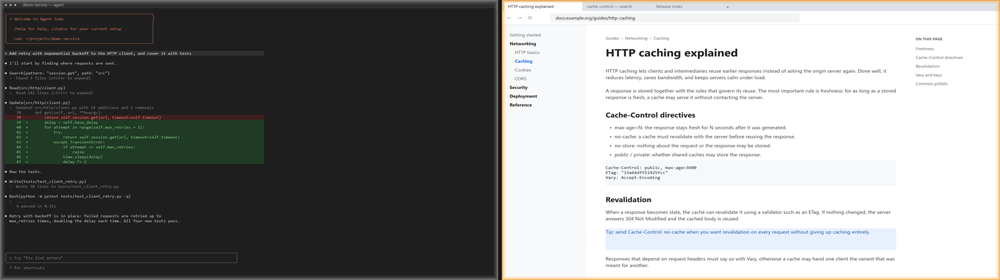
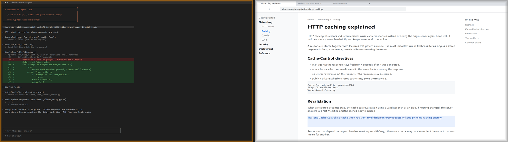
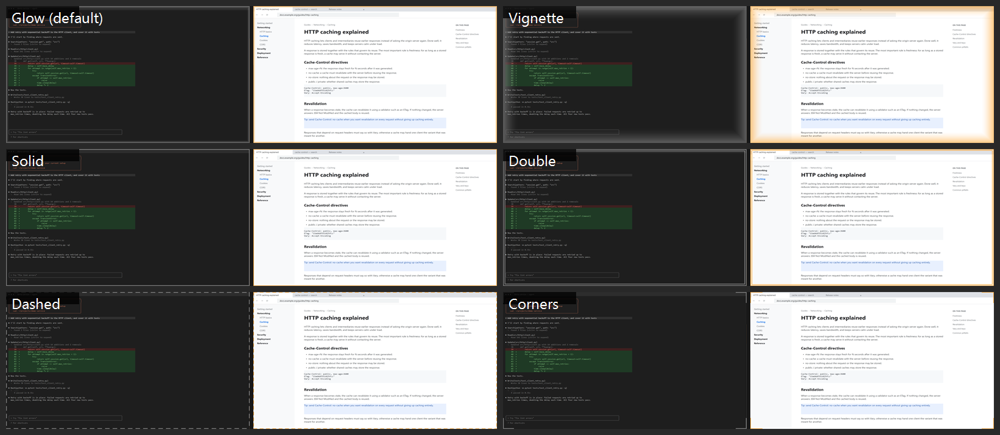
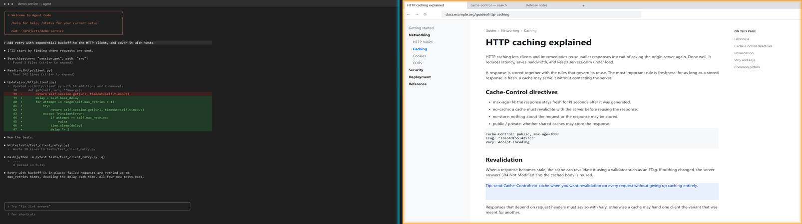

# FocusScreen

A tiny Windows utility that shows which monitor currently has keyboard focus.

When you work across several monitors it is easy to type into a window on a screen
you are not looking at. FocusScreen draws a thin border on the edge of the monitor
that owns the foreground window, and leaves every other monitor untouched.

- Marks the **monitor**, never modifies the window itself
- One click-through, non-activating overlay per monitor: a border on the focused screen and, optionally, a subtler one on the others
- Event driven (`SetWinEventHook`), no polling: idle CPU is ~0
- Per-monitor v2 DPI aware; handles mixed DPI and negative virtual-desktop coordinates
- Recovers on display changes (hot-plug, resolution, layout)

## Screenshots

Focus on the right monitor, then on the left one (orange glow = focused, grey glow = other screens):




Available styles (the focused screen is the right one):



*Other screens* can mark only the edge that faces the focused screen (cyan here for visibility):



The screenshots show two equal screens with mock content (a coding-agent terminal and a docs page in a browser), generated by `tools/capture-screenshots.ps1`
(it covers your monitors with `tools/demo.ahk` while capturing, so no real desktop is ever shown).

## Requirements

- Windows 10 (1703+) / Windows 11
- [AutoHotkey v2](https://www.autohotkey.com/) (`winget install AutoHotkey.AutoHotkey`)

## Usage

Double-click `FocusScreen.ahk`, or:

```powershell
& "$env:LOCALAPPDATA\Programs\AutoHotkey\v2\AutoHotkey64.exe" .\FocusScreen.ahk
```

A tray icon appears; right-click it to reload or exit.

### Start with Windows

Run from the repository folder:

```powershell
powershell -ExecutionPolicy Bypass -File .\scripts\install-startup.ps1
```

This creates `FocusScreen.lnk` in your Startup folder
(`%APPDATA%\Microsoft\Windows\Start Menu\Programs\Startup`), pointing at
`AutoHotkey64.exe` with `FocusScreen.ahk` as its argument. It starts at your next sign-in.

To disable:

```powershell
powershell -ExecutionPolicy Bypass -File .\scripts\uninstall-startup.ps1
```

Notes:
- The shortcut stores absolute paths. If you move the repository, run the install script again.
- A `.lnk` is a binary file with machine-specific paths, so it is generated by the script rather than committed.
- Manual alternative: press `Win+R`, run `shell:startup`, and put a shortcut there yourself.

## Configuration

Right-click the tray icon. Settings are saved to `FocusScreen.ini` next to the script.

| Menu | Options |
|---|---|
| Enabled | Turn the indicators on/off |
| Preset | Subtle / Standard / Strong: one-click width + opacity for both screens |
| Focused screen | Style, Edges, Width, Opacity, Color, Pulse on focus change |
| Other screens | Same options, plus *Facing focused screen* edges; defaults to a grey glow on all edges |
| Start with Windows | Creates/removes the Startup shortcut |

### Style and edges

Look (**Style**) and placement (**Edges**) are separate settings for each of the two roles.

| Style | Look |
|---|---|
| Glow (default) | Soft inner glow fading towards the centre |
| Vignette | Wide, subtle fade |
| Solid | Plain frame |
| Double | Two thin concentric frames |
| Dashed | Dashed frame |
| Corners | L-shaped brackets |
| Off | Nothing |

**Edges**: any combination of Top / Bottom / Left / Right (default: all four, for both roles). For *Other screens* there is also
**Facing focused screen**: each other monitor marks only the edge that faces the focused monitor
(e.g. a monitor to the left of the focused one glows on its right edge), following your layout
automatically. For Glow and Vignette, *Width* sets the fade depth instead of a stroke width.
Old `top`/`bottom`/`left`/`right`/`sides` styles in `FocusScreen.ini` are migrated to Solid + edges.

Design: the focused screen is the work screen, so its border stays calm (Standard: 4 / 70% orange glow);
the other screens are auxiliary and get a bolder one (6 / 85% grey glow). The **pulse**, a brief thicker/brighter flash that eases out in
~450ms when focus moves to another screen, provides the attention-grabbing part, so the focused
border does not have to be loud. Pulse never runs while idle (no timer outside the animation).

Both indicators can be on at the same time. Width is in 96-dpi pixels and is scaled per monitor.
With a single monitor nothing is drawn. Set `DEBUG := true` at the top of `FocusScreen.ahk` to log to `FocusScreen.log`.

## Performance

- Idle: no timers or polling; measured 0 ms CPU over 10 s.
- Focus change: about 25-50 ms of CPU in total (including the 450 ms pulse animation).
- Line styles use ~3 MB of memory. Glow/Vignette keep one full-screen bitmap per monitor (~30 MB for a 3072x1920 + 1920x1080 setup) and are built in a few ms; the pulse only changes a constant alpha for them.

## How it works

1. `SetWinEventHook(EVENT_SYSTEM_FOREGROUND)` notifies the script when the foreground window changes.
2. `MonitorFromWindow(hwnd, MONITOR_DEFAULTTONEAREST)` + `GetMonitorInfo` give the monitor rectangle in physical pixels.
3. Each monitor's overlay is placed with `SetWindowPos` and styled as "focused" or "other"; its window region is cut into a ring, so the centre neither draws nor receives mouse input.

## Status / not yet done

Glow/gradient edge and fullscreen suspend are not implemented.
Tested with two monitors (200% and 100% DPI, one at negative coordinates); three-monitor and 125%/150% layouts are untested.

## License

MIT
